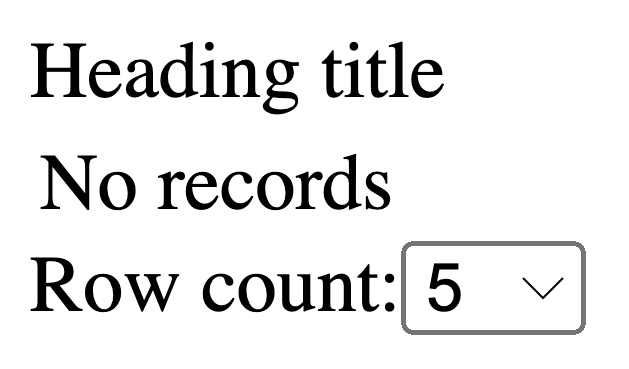
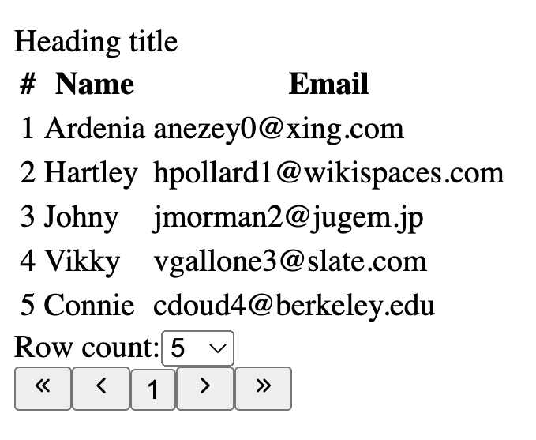
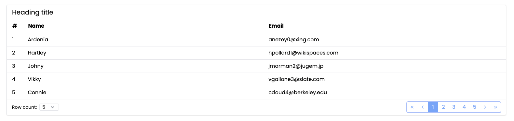

# **Vue 3 - DataTable**

This package let you create a datatable component for Vue.js fully customizable. The `<DataTable>` component is used for displaying tabular data. Features include sorting, pagination, content-editing and style customization.

-   [Basic usage](#basic-usage)
-   [Properties](#properties)
    -   [Columns](#columns)
    -   [Rows](#rows)
    -   [Options](#options)
-   [Slots](#slots)

#

## **Basic usage**

```js
<script setup>
import { DataTable } from "@franzisker/datatable";
</script>

<template>
    <DataTable />
</template>
```

If you don't use any property, the table will render as shown in the image below.



#

## **Properties**

### **Columns**

| Name     | Type    | Default | Description                                                  |
| -------- | ------- | ------- | ------------------------------------------------------------ |
| label    | String  | --      | Set the `<th>` column name                                   |
| field    | String  | --      | Has to match with the field name used in the data-row object |
| sortable | Boolean | false   | Enable the sorting feature for the column                    |

### **Rows**

```js
<script setup>
// If we have a columns property like the following:
const columns = [
	{
		label: "#",
		field: "id",
	},
	{
		label: "Name",
		field: "name",
	},
	{
		label: "Email",
		field: "email",
	},
];

// Then we should populate our data with a rows property like the following:
const rows = [
	{ id: 1, name: "Ardenia", email: "anezey0@xing.com" },
	{ id: 2, name: "Hartley", email: "hpollard1@wikispaces.com" },
	{ id: 3, name: "Johny", email: "jmorman2@jugem.jp" },
	{ id: 4, name: "Vikky", email: "vgallone3@slate.com" },
	{ id: 5, name: "Connie", email: "cdoud4@berkeley.edu" },
];
</script>

<template>
    <DataTable :columns="columns" :rows="rows" />
</template>
```

This will render the following datatable:



### **Options**

| Name          | Type   | Default             | Description                                                                                                                                                                 |
| ------------- | ------ | ------------------- | --------------------------------------------------------------------------------------------------------------------------------------------------------------------------- |
| title         | String | "Heading title"     | If not `null`, it renders a heading title on top of the datatable                                                                                                           |
| visibleBtns   | Number | 5                   | Changes the number of buttons that will be shown on the pagination button group relative to the current page                                                                |
| rowCount      | Number | 5                   | Changes the default number of rows per page shown (it's recommended that this option already exist in the `rowCountItems` array option)                                     |
| rowCountItems | Array  | [5, 10, 25, 50]     | Change the items that will be shown in the row count select and will filter the rows per page                                                                               |
| classes       | Object | [Classes](#classes) | Object that contains useful attributes to apply classes to the different elements of the datatable DOM. Below are all of the available attributes and their default values. |

#### **Classes**

By default, DataTable use WindiCSS classes with Vite integration. If you want the default classes to display a premade styled interface and have many other utilities go to [WindiCSS](https://windicss.org/integrations/vite.html) and configure your project to use it.



Here are the default classes used to build this layouts, but you can always override it to use your own classes:

```json
{
	"container": "rounded shadow border border-gray-200 bg-white dark:(bg-dark-600 border-gray-600)",
	"heading": {
		"container": "px-4 py-2 text-xl"
	},
	"content": {
		"container": "overflow-x-auto",
		"table": "w-full text-left",
		"thead": "",
		"tbody": "",
		"tr": "border-b border-gray-200",
		"th": "",
		"heading": {
			"container": "flex items-center justify-start space-x-2 px-4 py-2",
			"sortBtn": "w-full",
			"title": "text-base font-bold"
		},
		"td": "px-4 py-2",
		"empty": "px-4 py-2 text-gray-400"
	},
	"footer": {
		"container": "grid grid-cols-2",
		"rowCount": {
			"container": "col-span-2 md:(col-span-1 justify-self-start) px-4 py-2 justify-self-center self-center",
			"label": "text-sm mr-2",
			"select": "pl-2 pr-8 text-sm rounded border-gray-200 dark:(bg-dark-600 border-gray-600)"
		},
		"pagination": {
			"container": "col-span-2 md:(col-span-1 justify-end) flex justify-center",
			"groupBtn": "rounded text-blue-400 mx-4 my-2 ring-2 inline-flex",
			"pageBtn": "w-8 h-8 flex items-center justify-center hover:(bg-blue-400 text-white)",
			"activeBtn": "bg-blue-400 text-white",
			"prevBtn": "rounded-l",
			"nextBtn": "rounded-r"
		}
	}
}
```

#

## **Slots**

We are using this data to show how to use the slots:

```js
<script setup>
// If we have a columns property like the following:
const columns = [
	{
		label: "#",
		field: "id",
	},
	{
		label: "Name",
		field: "name",
	},
	{
		label: "Email",
		field: "email",
	},
];

// Then we should populate our data with a rows property like the following:
const rows = [
	{ id: 1, name: "Ardenia", email: "anezey0@xing.com" },
	{ id: 2, name: "Hartley", email: "hpollard1@wikispaces.com" },
	{ id: 3, name: "Johny", email: "jmorman2@jugem.jp" },
	{ id: 4, name: "Vikky", email: "vgallone3@slate.com" },
	{ id: 5, name: "Connie", email: "cdoud4@berkeley.edu" },
];
</script>
```

### **Heading**
This slot is inside the `<th>` elements and have the next properties:
| Name            | Type     | Description                                                  |
| --------------- | -------- | ------------------------------------------------------------ |
| setSort         | function | It has two string params (field, direction), the first is the field of the column you want to sort and the second is the direction you want to sort |
| getNewDirection | function | Returns the next direction value based on the current direction in order (null -> 'asc' -> 'desc' -> null ...) |
| sortField       | String   | Returns the current sort field or null if no sort is defined |
| sortDir         | String   | Returns the current sort direction or null if no sort is defined |
| column          | String   | Has all the [column](#columns) props that you define in the parent component |
| classes         | String   | Has all the classes that apply to the column (`options.classes.content.heading`)|

### **Item**
This slot is inside the `<td>` elements and have the next properties:
| Name            | Type     | Description                                                  |
| --------------- | -------- | ------------------------------------------------------------ |
| row             | Object   | Has the [row](#rows) data that you definde in the parent component for this row |
| col             | Object   | Has the [column](#columns) props that you definde in the parent component for this row |

### **Pagination**
In construction...

### **Row count**
In construction...
